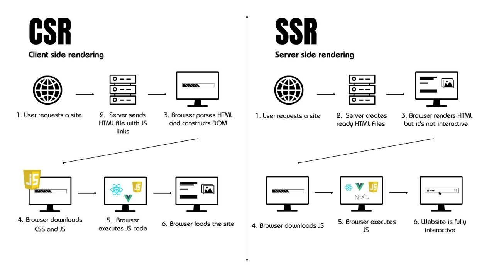

## Hinweis zum aktuellen Projektstand

Die aktuelle Version ist noch eine modulare Vanilla-TypeScript-Anwendung. React ist in
`package.json` noch nicht installiert, `src/main.ts` mountet keine React-Komponente und
`index.html` enthält weiterhin die fünf statischen View-Container. Die React-Migration aus
Demo 5 bis 10 ist daher noch offen; die folgenden Antworten unterscheiden zwischen dem
tatsächlich implementierten Stand und den geplanten React-Konzepten.

## Demo 1 — Historischer Überblick & Einordnung unserer App

### Entwicklung des Webs (kurz erklärt)

Früher war das Web eigentlich nur eine Ansammlung statischer HTML-Dokumente. Wenn man auf einen Link geklickt hat, hat der Server eine komplett neue Seite geschickt und der Browser wurde weiß (Full Page Reload). 

Mit **AJAX und Bibliotheken wie jQuery** (ab ca. 2005) konnte JavaScript dann endlich im Hintergrund Daten nachladen, ohne die ganze Seite neu zu laden. Das war der Anfang von **Single Page Applications (SPAs)**: JavaScript übernimmt das Ruder, wechselt Ansichten clientseitig und steuert die History (anfangs noch mit URL-Hashes wie `#dashboard`). 

Weil das manuelle Aktualisieren von DOM-Bäumen mit Vanilla JS aber schnell im Chaos endet, kamen später **komponentenbasierte Frameworks wie React** mit dem Virtual DOM dazu. Heute gibt es wieder viele Hybrid-Lösungen (Next.js, SSR, Islands), um Ladezeiten zu optimieren.


*(Quelle: [Medium / Web Architecture History](https://medium.com))*

---

### Wo steht unsere App (Project ReMotion)?

Ich würde unsere Vanilla-App historisch genau an die Grenze **zwischen der frühen SPA-Ära und modernen SPAs** setzen:

* **Typisch "Early SPA":** Wir nutzen handgestricktes Hash-Routing (`#dashboard`, `#evidence`) und bauen HTML über String-Zusammenstückelung (`innerHTML`) zusammen. Das hat man vor 10–12 Jahren genauso gemacht.
* **Modern daran:** Wir nutzen schon moderne Build-Tools wie **Vite** und **TypeScript**. 

Die App ist damit ein modularer Vanilla-TypeScript-Schritt auf dem Weg zu einer möglichen
React-Migration, aber noch keine React-App. Vite übernimmt bereits den Entwicklungsserver
und den Build, TypeScript die statische Typprüfung.

---

### Was ich live in den DevTools zeige:
1. Seite öffnen: `http://127.0.0.1:5173/#dashboard`
2. `F12` drücken $\rightarrow$ Tab **Network** $\rightarrow$ Filter auf **Doc** stellen.
3. Im Network-Tab den Filter auf **Doc** stellen.
4. Zwischen **Dashboard**, **Evidence** und **Timeline** hin- und herklicken.
5. **Ergebnis zeigen:** Es wird kein neues HTML-Dokument angefordert. Die Views werden
  clientseitig durch Hash-Routing und DOM-Updates gewechselt. Die JSON-Dateien werden beim
  Start per `fetch()` geladen.

---

### Fragen zu Demo 1

* **Welches Problem hat AJAX gelöst und welche neuen Probleme entstanden?**
  * *Gelöst:* Man musste nicht mehr bei jedem Klick warten, bis eine komplett neue HTML-Seite vom Server geladen wurde.
  * *Neue Probleme:* Der Zustand im Browser-Speicher und das DOM mussten per Hand synchron gehalten werden (Spaghetti-Code). Außerdem funktionierte der Zurück-Button des Browsers oft nicht mehr richtig, wenn man es nicht extra gecoded hat.
* **Wozu gehört das Hash-Routing (`#dashboard`)?**
  * Zur frühen SPA-Zeit (vor HTML5 `pushState`). Der Browser schickt alles hinter dem `#` gar nicht erst an den Server. So konnte man Routen wechseln, ohne dass der Server dafür extra eingerichtet sein musste.

---

## Demo 2 — SSR vs. CSR

### Der Vergleich

| Kriterium | Server-Side Rendering (SSR) | Client-Side Rendering (CSR) |
|---|---|---|
| **Erster Request** | Server schickt fertiges HTML mit allen Texten/Inhalten | Server schickt nur eine leere HTML-Hülle (`<div id="app"></div>`) |
| **Bis man was sieht** | Sehr schnell (Browser rendert direkt den Text) | Dauert etwas (Browser muss erst JS laden, ausführen und Daten fetchen) |
| **Navigation danach** | Meist neuer Seitenabruf vom Server | Rein im Browser via JS, Seite lädt nicht komplett neu |


*(Grafik: Vergleich von CSR und SSR)*

---

### Real-Life Beispiel: Wikipedia (SSR)
Wikipedia ist das klassische Beispiel für SSR:
1. Beliebigen Wikipedia-Artikel aufrufen.
2. Rechtsklick $\rightarrow$ **Seitenquelltext anzeigen** (`Strg + U`).
3. Mit `Strg + F` nach einem Wort aus dem Artikel suchen.
4. Man findet den Text sofort im HTML-Quelltext. Der Server hat das HTML also schon fertig gerendert geliefert, ganz ohne Client-JS.

---

### Step-by-Step: Wie das Dashboard in ReMotion sichtbar wird (CSR)
1. **HTML anfordern:** Der Browser lädt `index.html`. Da ist das Dashboard noch leer (`<div id="dashboardContent"></div>`).
2. **Skript starten:** Die Datei `src/main.ts` wird geladen. Beim Event `DOMContentLoaded` startet `initApp()`.
3. **Daten holen:** `js/api.ts` holt über `fetch()` die lokalen JSON-Dateien
  (`case.json`, `evidence.json`, `people.json`, `locations.json` und `timeline.json`) aus
  dem Vite-Server; es gibt dafür kein Backend.
4. **HTML berechnen:** `js/dashboard.ts` berechnet Statistiken wie Review-Progress und baut
  einen HTML-String.
5. **DOM einfügen:** Mit `container.innerHTML = html` wird der Dashboard-Inhalt in den
  vorhandenen Container eingesetzt. Erst dann ist der dynamische Inhalt sichtbar.

---

### Fragen zu Demo 2

* **Was ist der echte Nachteil (Cost) von CSR?**
  * **Volle Abhängigkeit von JavaScript:** Wenn man in den DevTools JavaScript deaktiviert (`Strg + Shift + P` $\rightarrow$ *"Disable JavaScript"*), bleibt die App bei *"Loading case file..."* hängen und ist komplett tot. Auf langsamen Handys dauert es außerdem spürbar länger, bis überhaupt etwas angezeigt wird.

---

## Demo 3 — Das Virtual DOM

### Was ist das Virtual DOM in einfachen Worten?
Das Virtual DOM ist einfach ein normales JavaScript-Objekt im Arbeitsspeicher, das beschreibt, wie die UI gerade aussehen soll. 

Wenn sich etwas ändert (z. B. ein Klick auf ein Lesezeichen), erzeugt React ein neues virtuelles Abbild und vergleicht es mit dem alten (**Reconciliation / Diffing**). Dann aktualisiert React gezielt nur die wenigen Stellen im echten Browser-DOM, die sich wirklich verändert haben, anstatt die ganze Liste neu zu bauen.


*(Quelle: [React Docs / GeeksforGeeks](https://react.dev))*

---

### Das Problem im alten `app.js`
Im ursprünglichen, inzwischen auskommentierten `app.js` und im aktuellen
`js/evidence.ts` gibt es beim Bookmark-Klick ein vergleichbares Muster:

```javascript
function handleBookmarkClick(evidenceId, e) {
  // 1. Nur ein einzelner Bookmark-Wert im Array ändert sich:
  // ...
  // 2. Aber danach wird die KOMPLETTE Liste neu generiert:
  if (currentPage === "evidence") renderEvidenceList();
}
```

In `renderEvidenceList()` wird dann eine Schleife über **alle** Einträge ausgeführt und am Ende steht:
```javascript
container.innerHTML = html;
```
Das bedeutet: Selbst wenn ich nur bei Karte 3 das Sternchen anklicke, werden alle anderen 20 Karten im echten DOM gelöscht und komplett neu erzeugt.

#### Mein Live-Beweis in der Konsole:
```javascript
// Referenz auf die erste Karte im Speicher sichern:
window.testCard = document.querySelector(".evidence-card");

// Jetzt manuell bei einer ANDEREN Karte auf den Stern klicken...

// Prüfen, ob die alte Karte noch mit dem DOM verbunden ist:
console.log(testCard.isConnected); // Gibt 'false' aus!
```
Obwohl die erste Karte unverändert aussieht, wurde ihr DOM-Knoten vernichtet und ersetzt.
Der aktuelle Code verwendet dafür ebenfalls `renderEvidenceList()` und setzt den gesamten
Evidence-Container mit `innerHTML` neu.

---

### Fragen zu Demo 3

* **Wie verhindert das Virtual DOM das?**
  * React merkt beim Komponenten-Vergleich, dass sich bei den anderen Karten gar nichts geändert hat. Nur bei der geklickten Karte wird das Attribut für den Stern aktualisiert. Der Rest bleibt unberührt.
* **Ist das Virtual DOM immer schneller als direktes DOM-Manipulieren?**
  * Nein! Das Vergleichen der Bäume (Diffing) kostet auch Rechenzeit. Wenn ich in Vanilla JS exakt weiß, was sich ändert, und einfach `star.classList.toggle('active')` schreibe, ist das schneller als jedes VDOM. Aber gegenüber faulem `innerHTML = ...` auf ganzen Containern ist React viel schonender für den Browser.
* **Macht React eine App automatisch schnell?**
  * Nein. Wenn man State an der falschen Stelle speichert, rendert React ständig die halbe App neu. Auch schwere Schleifen ohne `useMemo` oder fehlende `key`-Props in Listen können eine React-App lahmlegen.

---

## Demo 4 — SPA vs. MPA: State & Routing

### Wie Navigation bei uns abläuft
1. Der User klickt auf einen Nav-Button $\rightarrow$ `navigateTo("evidence")` wird aufgerufen.
2. Das setzt `window.location.hash = "evidence"`.
3. Der Browser feuert das Event `hashchange`.
4. Die Funktion `handleHashChange()` fängt das ab, nimmt allen Views die CSS-Klasse `.active` weg und gibt sie dem Element `#view-evidence`.
5. **Kein Reload!** Alles bleibt in derselben Seite.

---

### Was überlebt einen Page Reload (F5)?

* **Bleibt erhalten (persistiert):**
  * Alles, was in `localStorage` geschrieben wird: Lesezeichen (`STORAGE_KEY_BOOKMARKS`), Notizen (`STORAGE_KEY_NOTES`) und der Entwurf im Workspace.
  * Die aktuelle Ansicht (weil sie in der URL als `#hash` steht und beim Neuladen wieder ausgelesen wird).
* **Geht verloren (In-Memory):**
  * Ausgewähltes Element in der Evidence-Detailansicht.
  * Aktive Suchfilter und Dropdown-Sortierungen.
  * Ungespeicherte Eingaben in Textfeldern.
  * Die Rohdaten im Speicher (werden beim Reload aber einfach neu aus den JSON-Dateien gefetcht).

---

### Fragen zu Demo 4

* **Wo lebt der State in einer traditionellen MPA im Vergleich zur SPA?**
  * Bei einer MPA verwirft der Browser beim Seitenwechsel den gesamten Speicher. Daten leben deshalb auf dem Server (in Datenbanken oder Server-Sessions).
  * Bei unserer SPA lebt fast der gesamte State im Arbeitsspeicher des Browsers (in der JavaScript-Variable `state`).
* **Was kann eine echte Router-Bibliothek besser als unser Hand-Router?**
  * Parameter in der URL verarbeiten (z. B. `/evidence/:id`).
  * Verschachtelte Routen (Nested Routes).
  * Abfangen von Routenwechseln (z. B. Warnung anzeigen, wenn noch ungespeicherte Notizen im Formular stehen).
* **Was passiert beim Klick auf den Browser-Zurück-Button?**
  * Der Browser wechselt den Hash in der Adresszeile auf den vorherigen Eintrag aus der History.
  * Das triggert wieder das `hashchange`-Event und unsere Funktion `handleHashChange()` schaltet die CSS-Klasse auf die vorherige Ansicht um. Es gibt auch hier keinen Neuladen der Seite.